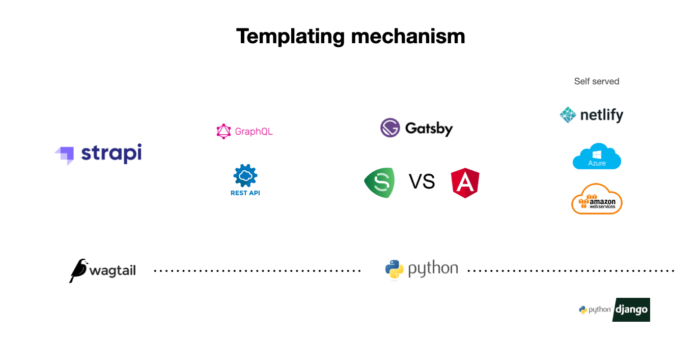

# Strapi Starter Gatsby Kuesa

Gatsby starter for creating Kuesa with Strapi.


This starter allows you to try Strapi with Gatsby with the example of Kuesa. It is fully customizable and due to the fact that it is open source, fully open to contributions. So do not hesitate to add new features and report bugs!

Pages:

- "/" to display every articles

## Getting started

The easiest way to try this starter is to run it locally on your computer.

First, you'll need to create your own copy of this starter. You can do so by clicking [the "Use this template" button](https://github.com/blanke/strapi-starter-gatsby-kuesa) on GitHub, and filling the [form](https://docs.github.com/en/github/creating-cloning-and-archiving-repositories/creating-a-repository-from-a-template)

### Backend

Create a Strapi project named `backend` using the [kuesa template](https://github.com/blanke/strapi-template-kuesa):

```
# Using Yarn
yarn create strapi-app backend --template https://github.com/blanke/strapi-template-kuesa

# Or using NPM
npx create-strapi-app backend --template https://github.com/blanke/strapi-template-kuesa
```

The Strapi server will automatically start and import sample seed data.

##### is static html for kuesa.com possible?
Tested with https://amazing-allen-c666b1.netlify.app

### Frontend



Leave the Strapi backend running in the background. Open another terminal tab, and make sure you're in the `frontend` directory:

```bash
cd frontend
```

Install dependencies and start the Gatsby server:

```bash
# Using yarn
yarn install
yarn develop

# Using npm
npm install
npm run develop
```

If you want to change the default environment variables, create a `.env` file like this:

```sh
cp .env.example .env
```

The Gatsby server will run here => [http://localhost:3000](http://localhost:3000)

Enjoy this starter!
